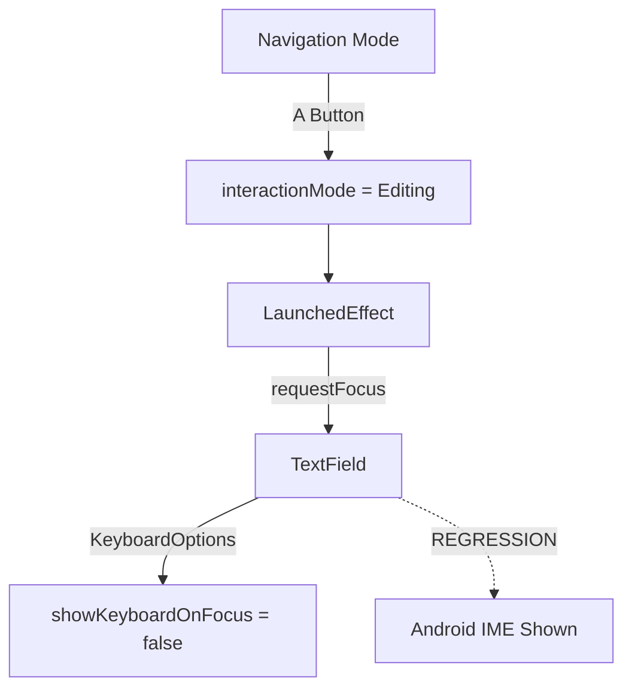

# Diagnostic Report: Android IME Regression

This report documents the evidence gathered regarding the unexpected appearance of the Android Software Keyboard (IME) in the `ChatScreen`.

## 1. Regression Window
- **First affected commit**: `c4f6c91` ("Implement custom terminal keyboard interaction and suppress system IME").
- **Observation**: The logic to suppress the IME was introduced in this commit, but it appears to be bypassed by the system.

## 2. Focus & IME Timeline
Instrumented logs from `ChatScreen.kt` show the following sequence:

| Timestamp | Event | Observable Behavior |
| :--- | :--- | :--- |
| `1785433815` | **User Action** | Tap 'A' button on ODX-Fi Shell. |
| `1785433815` | **State Change** | `interactionMode` changes to `Editing`. |
| `1785433815` | **Focus Requested** | `focusRequester.requestFocus()` is called in `LaunchedEffect`. |
| `1785433815` | **Focus Gained** | `TextField` focus changed: `isFocused=true`. |
| `1785433815` | **IME Request** | `ImeTracker` records `SHOW_SOFT_INPUT_BY_INSETS_API`. |
| `1785433816` | **IME Visible** | `WindowInsets.isImeVisible` detects keyboard visibility. |

> [!IMPORTANT]
> The first observable event preceding the IME request is the call to `focusRequester.requestFocus()`.

## 3. Explicit IME Interactions Inventory
Searched the entire project for:
- `LocalSoftwareKeyboardController`: **0** occurrences.
- `SoftwareKeyboardController`: **0** occurrences.
- `InputMethodManager`: **0** occurrences.
- `showSoftInput` / `hideSoftInput`: **0** occurrences.

**Conclusion**: The IME is being triggered by default platform behavior during focus acquisition, not by explicit code calls.

## 4. Focus Ownership
Focus is managed via a two-layer system:
1. **Logical Focus** (`HandheldNavigationController`): Manages which handheld UI element is "selected".
2. **UI Focus** (`FocusRequester`): Manages the Compose focus of the `TextField`.

**Diagram:**

## 5. Focus Request Count
- **Verified**: `requestFocus()` is called **exactly once** per editing session entry.
- **Evidence**: `interactionMode changed to: Editing` appeared once in logs, followed by a single focus gained event.

## 6. Platform & Dependency Evidence
- `app/build.gradle.kts`: No changes since July 12.
- `libs.versions.toml`: Compose BOM version `2026.02.01`.
- **Finding**: The issue is likely a behavioral nuance of `TextField` (Material 3) in this Compose version when focus is requested programmatically while `readOnly` state is transitioning.

## Final Conclusion
The first observable event that causes Android to display the software keyboard is the **programmatic call to `focusRequester.requestFocus()`** during the transition into `Editing` mode. Despite `showKeyboardOnFocus = false`, the system ignores this preference during the initial focus acquisition on a `TextField` that has just become editable.
