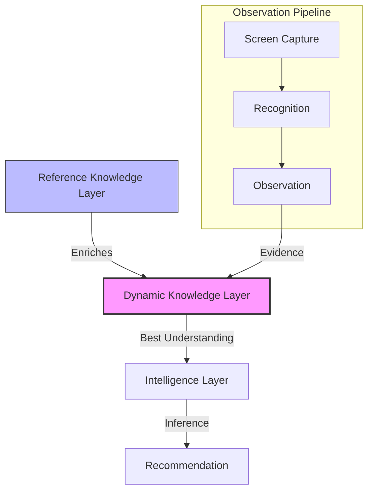

# Dynamic Knowledge Layer

## Philosophy

Overdex distinguishes between three core concepts:

1.  **Reference Knowledge**: "What is generally true?" (e.g., The Pokédex says Mewtwo is Psychic).
2.  **Observations**: "What was just seen?" (e.g., The screen appears to show a Mewtwo).
3.  **Dynamic Knowledge**: "What do we currently believe about this battle?" (e.g., The opponent is confirmed to be Mewtwo).

**Dynamic Knowledge** represents the system's current best understanding of the battle based on available evidence. It is the bridge that connects raw observations to tactical intelligence.

---

## Knowledge Characteristics

### Best Understanding (Not Final Truth)
Dynamic Knowledge is not "stable" in the sense of being immutable. It represents a belief that evolves as new evidence arrives.

### Mutability & Supersedence
Dynamic Knowledge is mutable. A new observation with higher confidence can supersede an existing knowledge item. For example, a "fuzzy" species recognition might be updated once the name becomes clearly legible.

### Withdrawal
Knowledge can be withdrawn if later evidence proves the earlier belief was a false positive.

### Coexistence
Contradictory knowledge items should generally not coexist at the same level of belief. The layer is responsible for resolving conflicts (e.g., through confidence voting or temporal priority) to provide a single "best understanding" to consumers.

### Versioning
Every change to a Dynamic Knowledge item should be recorded as a new state, allowing the system to "rewind" and see what it believed at any point in the battle timeline.

### Traceability
Every piece of Dynamic Knowledge **must** retain links to all supporting Observations. This ensures that every recommendation made by Overdex is traceable back to the raw evidence seen on the screen.

---

## Observation → Knowledge Lifecycle

```text
Capture (Screen)
   ↓
Recognition (OCR/ML)
   ↓
Observation (Factual Record)
   ↓
Dynamic Knowledge (Best Understanding) <--- Enriched by Reference Knowledge
   ↓
Intelligence (Inference/Strategy)
   ↓
Recommendation (Player Guidance)
```

1.  **Capture**: The raw visual data from Pokémon GO.
2.  **Recognition**: The act of extracting text or patterns (e.g., "M-e-w-t-w-o").
3.  **Observation**: A point-in-time factual record ("Observer X saw Mewtwo at Timestamp T").
4.  **Dynamic Knowledge**: The system reconciles multiple observations (e.g., three separate Mewtwo sightings) and enriches them with Reference Knowledge (e.g., Mewtwo's typing and move pool) to form a belief.
5.  **Intelligence**: Uses Dynamic Knowledge to perform complex reasoning (e.g., "Since the opponent is Mewtwo and used Psycho Cut, they likely have Psystrike ready").
6.  **Recommendation**: Communicates the result to the player (e.g., "Shield recommended").

---

## Knowledge Model

A Dynamic Knowledge object typically contains:

| Property | Description |
| :--- | :--- |
| `identifier` | A unique ID for the knowledge item (e.g., `enemy_slot_1_species`). |
| `type` | The category of knowledge (e.g., `SPECIES`, `MOVE`, `ENERGY_STATE`). |
| `value` | The current believed value (e.g., `"Mewtwo"`). |
| `confidence` | A score representing how certain the system is (0.0 to 1.0). |
| `evidence` | A list of references to the `Observation` objects that support this belief. |
| `lastUpdated` | Timestamp of the most recent supporting observation. |
| `validity` | State of the knowledge (e.g., `CONFIRMED`, `TENTATIVE`, `WITHDRAWN`). |
| `provenance` | A summary of where the evidence came from (e.g., "Local OCR + Partner Sync"). |

---

## Knowledge Derivation

Dynamic Knowledge is formed by merging evidence from multiple sources:

### Single Observation
A high-confidence observation (e.g., a clear OCR of a move name) can immediately create or update a knowledge item.

### Multi-Observation Consensus
Multiple low-confidence observations that agree (e.g., three different frames showing "Mew..." in the species area) can be aggregated to form a high-confidence knowledge item.

### Reference Enrichment
When a species is observed, Dynamic Knowledge is enriched with **Reference Knowledge**:
- **Observation**: "Species is Mewtwo"
- **Reference**: "Mewtwo's Fast Moves are Psycho Cut and Confusion"
- **Knowledge**: "Opponent is Mewtwo. Possible fast moves are limited to {Psycho Cut, Confusion}."

---

## Consumer Model

The following systems are the primary consumers of Dynamic Knowledge:

-   **Battle Memory**: Stores the sequence of beliefs throughout the battle.
-   **Battle Timeline**: Visualizes when specific knowledge was gained or changed.
-   **Recommendations**: Uses current knowledge (e.g., "Opponent is Swampert") to suggest actions (e.g., "Switch to Venusaur").
-   **Team Analysis**: Aggregates knowledge across multiple battles to identify patterns in opponent teams.
-   **AI Assistance**: Provides natural language explanations based on why the system believes what it believes.

---

## Relationship Diagram



---

## Acceptance Criteria for Implementation
1.  **Traceability**: Can I click a recommendation and see the Observations that generated it?
2.  **Evolution**: Does the UI update smoothly when a belief changes (e.g., correcting a species name)?
3.  **Separation**: Is the Intelligence engine (energy counting) decoupled from the Observation engine (OCR)?
4.  **Enrichment**: Does identifying a species automatically unlock its move database for the Intelligence layer?
