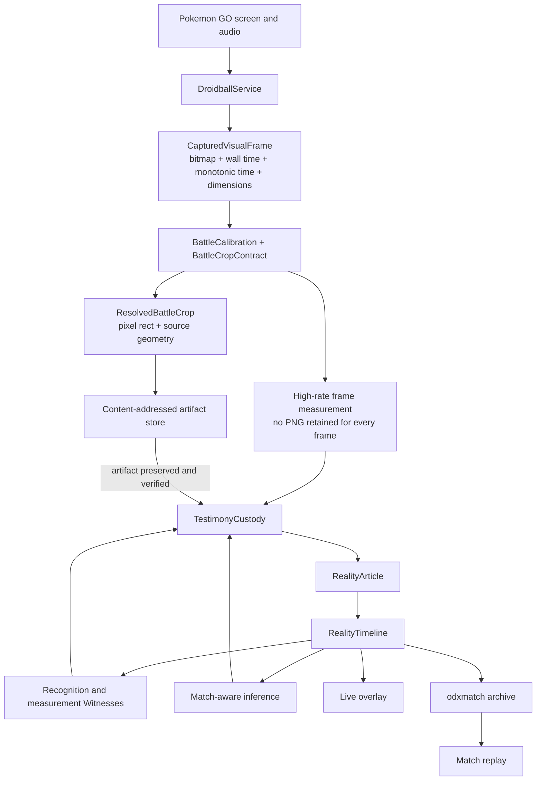

# Overdex Architecture Map

**Status:** Active architecture guide

**Verified against the working tree:** September 28, 2026

**Generated file inventory:** [CODEBASE_INDEX.md](CODEBASE_INDEX.md)

This document explains which systems currently carry Overdex at runtime and how
information moves between them. It is intentionally smaller than the complete
file inventory. The historical [PROJECT-MAP.md](PROJECT-MAP.md) remains preserved
as an earlier snapshot.

## Status labels

| Label | Meaning |
| --- | --- |
| **Canonical** | The current production path for this responsibility. New battle work should use it. |
| **Supporting** | Active code used by a canonical path, but not the owner of that responsibility. |
| **Legacy-active** | Still referenced at runtime or by an active feature. Do not remove it without migrating its callers. |
| **Debug** | Diagnostics, validation, or developer tooling. It is not the match record. |
| **Archive** | Preserved history or excavation material. It is intentionally outside the runtime architecture. |

## Architectural invariants

These rules are the stable boundary for new battle work:

1. A **Battle Region** is a spatial territory. A crop names what is being
   measured there. A Witness produces exactly one signal.
2. A captured crop becomes testimony only after its PNG bytes have been written
   and verified. `CropCaptured` carries an immutable repository-relative SHA-256
   reference, never an in-memory bitmap or an absolute path.
3. A persisted raw crop enters Custody and the Reality Timeline before formal
   recognition or inference consumes it. High-rate measurement paths may avoid
   retaining every frame, but their measurements, time, geometry, and Witness
   availability still enter the Timeline.
4. Wall time provides human/archive chronology. Monotonic time provides elapsed
   measurement. Frame arrival does not advance or pause the clock.
5. Witness availability is evidence. Until an operating record exists, the
   Timeline must not assume that a witness was observing.
6. A Droidball session surrounds zero or more battle attempts. A Match describes
   an actual battle record. Starting assistance does not make a Match active.
7. Replay may use later evidence to render what was present earlier, while
   retaining how and when that identity became known. It never rewrites the
   archived Articles.
8. Player combatants render on the left; opponent combatants render on the right.

## Runtime composition

The principal composition points are:

| Responsibility | Owner | Status |
| --- | --- | --- |
| Android navigation and ODX-Fi shell | [MainActivity.kt](app/src/main/java/com/example/overdex/MainActivity.kt) | **Canonical** |
| Observation-session construction and Witness registration | [PokedexViewModel.kt](app/src/main/java/com/example/overdex/ui/PokedexViewModel.kt) | **Canonical** |
| Screen and audio capture service | [DroidballService.kt](app/src/main/java/com/example/overdex/battle/observation/DroidballService.kt) | **Canonical** |
| Session lifecycle around a possible battle | [DroidballSession.kt](app/src/main/java/com/example/overdex/battle/observation/DroidballSession.kt) | **Canonical** |
| Match custody-to-Timeline publication and match-aware derivation | [Match.kt](app/src/main/java/com/example/overdex/battle/observation/Match.kt) | **Canonical** |
| Live overlay state | [DroidballOverlayPresentation.kt](app/src/main/java/com/example/overdex/battle/observation/DroidballOverlayPresentation.kt) | **Canonical presentation state** |

`PokedexViewModel` currently acts as the battle composition root. It creates the
Match and Droidball session, loads calibration, constructs artifact stores,
registers Witnesses, follows service signals, checkpoints the active Match, and
exports completed Matches.

## Canonical capture-to-Timeline flow



The decisive implementation files are:

- [CapturedVisualFrame.kt](app/src/main/java/com/example/overdex/model/observation/CapturedVisualFrame.kt) preserves capture time and frame geometry.
- [BattleCalibration.kt](app/src/main/java/com/example/overdex/data/BattleCalibration.kt) owns runtime calibrated Battle Regions.
- [BattleCropContract.kt](app/src/main/java/com/example/overdex/battle/observation/BattleCropContract.kt) resolves normalized regions into validated pixel rectangles and crop provenance.
- [BattleObservationContracts.kt](app/src/main/java/com/example/overdex/battle/observation/BattleObservationContracts.kt) names configured regions, crops, and single-output Witness contracts.
- [CropCaptureWitness.kt](app/src/main/java/com/example/overdex/battle/observation/CropCaptureWitness.kt) persists the crop before submitting `CropCaptured` testimony.
- [CropArtifactStore.kt](app/src/main/java/com/example/overdex/battle/artifact/CropArtifactStore.kt) implements `artifacts/crops/sha256/<digest>.png` identity and verification.
- [TestimonyCustody.kt](app/src/main/java/com/example/overdex/battle/custody/TestimonyCustody.kt) preserves testimony and source-availability records without dropping bursts.
- [RealityArticle.kt](app/src/main/java/com/example/overdex/battle/reality/RealityArticle.kt) is the immutable record envelope.
- [RealityTimeline.kt](app/src/main/java/com/example/overdex/battle/reality/RealityTimeline.kt) is the canonical Match ledger.

Failure to preserve an artifact means “crop not preserved.” No partial
`CropCaptured` testimony is accepted.

High-rate HP measurement is an explicit retention exception. The live HP
Witnesses may measure every usable frame without encoding every crop as PNG.
Their testimony retains the captured-frame time, calibrated geometry is fixed by
the crop contract, Witness availability records coverage, and sparse HP crops
remain available for forensic inspection. This keeps cadence measurable without
making an archive approach video size.

## Session and Match lifecycle

```text
Droidball session
    deploy -> assistance armed -> calibration/team setup -> countdown
           -> battle active -> result -> armed for another Match -> ended

Battle Match
    MatchRecordStarted -> pre-GO evidence -> GO/accepted boundary
    -> live battle evidence -> MatchEnded -> archive/checkpoint
```

[DroidballSession.kt](app/src/main/java/com/example/overdex/battle/observation/DroidballSession.kt)
owns `ARMED`, `CALIBRATING`, `COUNTDOWN`, `BATTLE_ACTIVE`, `RESULT`, and
`ENDED`. [MatchState.kt](app/src/main/java/com/example/overdex/battle/observation/MatchState.kt)
describes the battle record itself. VS, countdown glyphs, announcements, active
species, and active type evidence may establish the battle surface and open the
HUD without pretending that the GO boundary was observed.

[MatchClock.kt](app/src/main/java/com/example/overdex/battle/observation/MatchClock.kt)
reads an independent monotonic authority. It is available before GO; captured
frames receive readings from that same authority.

## Recognition, measurement, and inference

### Species

- [PersistedSpeciesWitness.kt](app/src/main/java/com/example/overdex/battle/observation/PersistedSpeciesWitness.kt) is the formal persisted-crop species Witness. Its accepted result enters Custody and the Timeline.
- [LiveOverlaySpeciesPipeline.kt](app/src/main/java/com/example/overdex/battle/observation/LiveOverlaySpeciesPipeline.kt) is a low-latency, presentation-only OCR lane over an already preserved crop. It may fill the live HUD provisionally; it does not replace formal testimony.
- [PersistedAnnouncementSpeciesWitness.kt](app/src/main/java/com/example/overdex/battle/observation/PersistedAnnouncementSpeciesWitness.kt), team-roster testimony, and battle-cry candidates provide independent evidence that may support or refute identity.
- [SpeciesCheckCoordinator.kt](app/src/main/java/com/example/overdex/battle/observation/SpeciesCheckCoordinator.kt) schedules burst checks around cues rather than treating species OCR as a permanent high-rate workload.

The low-latency overlay lane currently receives a direct callback immediately
after `CropCaptured` enters Custody. The artifact is durable first, but the
callback can race the coroutine that publishes the corresponding
`RealityArticle`. Formal species testimony remains Timeline-first. Moving the
presentation lane onto `Match.activeSpeciesCropArticles` would make the strict
Timeline-before-presentation ordering universal.

### HP cadence and moves

- [LiveActiveHpBarWitnesses.kt](app/src/main/java/com/example/overdex/battle/observation/LiveActiveHpBarWitnesses.kt) tracks active HP-bar geometry and live motion/border behavior.
- [PersistedActiveHpBarWitness.kt](app/src/main/java/com/example/overdex/battle/observation/PersistedActiveHpBarWitness.kt), [PersistedActiveHpBarCadenceWitness.kt](app/src/main/java/com/example/overdex/battle/observation/PersistedActiveHpBarCadenceWitness.kt), and [PersistedActiveHpBarBorderPulseWitness.kt](app/src/main/java/com/example/overdex/battle/observation/PersistedActiveHpBarBorderPulseWitness.kt) preserve separate measurements.
- [FastMoveCadenceInference.kt](app/src/main/java/com/example/overdex/battle/inference/FastMoveCadenceInference.kt) compares measured cadence with species move knowledge and publishes derived conclusions through the Match.
- An HP tick or border pulse on one side is evidence of the opposing combatant's Fast Move. The moving bar belongs to the Pokémon whose animation moves it.

### Audio

- [AudioCaptureWitness.kt](app/src/main/java/com/example/overdex/battle/audio/AudioCaptureWitness.kt) owns capture availability and PCM publication.
- [PersistedBattleCryCandidateWitness.kt](app/src/main/java/com/example/overdex/battle/audio/PersistedBattleCryCandidateWitness.kt) preserves ranked cry candidates as evidence rather than silently promoting the strongest candidate to fact.
- [FastMoveSoundMeasurement.kt](app/src/main/java/com/example/overdex/battle/audio/FastMoveSoundMeasurement.kt) measures sound timing/type features that can corroborate visual cadence.

## Presentation

[BattleOverlay.kt](app/src/main/java/com/example/overdex/ui/components/BattleOverlay.kt)
renders the live Droidball HUD from presentation state. Presentation is allowed
to react quickly, but it is not the historical authority.

The HUD can show known species and possible moves before a specific move has
been identified. Hazard emphasis is derived from reference knowledge and the
player's active typing. Presentation decisions never alter captured testimony.

## Archive and replay

- [MatchArchivePackageWriter.kt](app/src/main/java/com/example/overdex/battle/archive/MatchArchivePackageWriter.kt) writes manifest, Timeline, and selected artifacts.
- [MatchArchivePackageReader.kt](app/src/main/java/com/example/overdex/battle/archive/MatchArchivePackageReader.kt) validates archive structure, size, hashes, and portable artifact references.
- [MatchArchiveArticleSelector.kt](app/src/main/java/com/example/overdex/battle/archive/MatchArchiveArticleSelector.kt) distinguishes compact and forensic article selection.
- [RealityArticleArchiveMapper.kt](app/src/main/java/com/example/overdex/battle/archive/RealityArticleArchiveMapper.kt) maps live immutable Articles into portable archive payloads.
- [MatchReplayModel.kt](app/src/main/java/com/example/overdex/battle/replay/MatchReplayModel.kt) buffers the complete archive and projects it into replay scenes. It can use evidence learned later to identify earlier visible combatants while exposing that reconstruction basis.
- [ReplayHpTrack.kt](app/src/main/java/com/example/overdex/battle/replay/ReplayHpTrack.kt) projects measured HP, damage trails, and border pulses for each combatant's appearance. Missing HP remains unknown. Replay's LCD event-blip toggle persists independently of its transport sounds.
- [ArchivedSpeciesCropRecognizer.kt](app/src/main/java/com/example/overdex/battle/replay/ArchivedSpeciesCropRecognizer.kt) can recover identity from preserved archive crops without modifying the archive.

Each Match has its own ID, Timeline, archive source, and replay projection.

## Parallel and legacy systems

These names overlap with the canonical Match pipeline but do not mean the same
thing:

| System | Current status | Boundary |
| --- | --- | --- |
| `battle.reality.RealityTimeline` | **Canonical** | Immutable Article ledger used by current Match archives and replay. |
| `battle.timeline.BattleTimeline` | **Debug/legacy-active** | Used by verification, tests, and the old pipeline demo; it is not the current Match archive ledger. |
| `model.BattleTimeline` | **Legacy-active** | Used by the earlier `BattleMemory` path. |
| `SharedTimelineRepository` and `SharedTimelineScreen` | **Retired concept, legacy-active code** | Still reachable by current UI wiring. It must not be used for Match recording or new sharing work. |
| `model.Observation` | **Legacy-active** | Raw crop object used by `ObservationExtractor`; not a Battle Region or current RealityArticle. |
| `model.observation.Observation` | **Legacy-active/supporting** | Used by registration, general observation inputs, and older Witnesses. |
| `battle.observation.Observation` | **Supporting/debug** | Used by the battle workspace, debug factories, and verification paths. |
| `battle.debug.observatory.MatchRecording` | **Debug/legacy-active** | Flight-recorder UI still has callers. It is not an `.odxmatch` archive. |
| `CaptureRegion` and `ObservationRegion` | **Non-battle legacy-active** | Existing callers may remain, but new battle geography uses `BattleCalibration`, `BattleRegionId`, and `BattleCropContract`. |

Do not remove a legacy-active system merely because a canonical replacement
exists. Migrate or retire its callers first. The reviewed cleanup state is kept
in [UNFINISHED_CODE_INVENTORY.md](UNFINISHED_CODE_INVENTORY.md).

## Known implementation boundary gaps

- The conceptual Droidball assistance session may span multiple Matches. The
  current implementation constructs a new `DroidballSession` beside each new
  `Match` while the capture service remains running. The service/deployment
  state currently represents the longer-lived assistance boundary.
- `LiveOverlaySpeciesPipeline` is artifact-first and post-Custody, but it is not
  guaranteed to be post-Timeline because it receives `CropCaptureWitness`'s
  direct completion callback.
- Several retired or superseded families remain active through callers. Their
  status is recorded above and in the unfinished-code inventory so that name
  overlap is not mistaken for shared ownership.

## Archive material

[`DexDox/Archive Dox/`](<DexDox/Archive Dox/>) and
[`DexDox/Ontology(old).md`](DexDox/Ontology%28old%29.md) preserve project history.
They are excluded from the runtime architecture and are not cleanup targets by
default.

## Keeping this map current

Update this narrative only when an ownership boundary or canonical runtime flow
changes. File additions and removals belong in the generated index:

```bash
./tools/generate-codebase-index.sh
```

That separation lets the architecture remain readable while the complete file
inventory follows infrastructure changes automatically.
